# ArtiChat

An intelligent article processing system that ingests web content, analyzes it with AI, and provides semantic search and chat capabilities. The system features dual-layer caching for 10x performance improvements and handles real-time document processing through an async pipeline.

**Key Features:**

- 📰 **Smart Ingestion**: Automatically processes articles from URLs with content analysis
- 🤖 **AI Chat Agent**: LangChain-powered conversational interface with 6 specialized tools
- ⚡ **Dual Caching**: L1 exact-match (Redis) + L2 semantic similarity (ChromaDB)
- 🔍 **Vector Search**: Semantic document retrieval with configurable similarity thresholds
- 📊 **Metadata Analysis**: Auto-extracts summaries, sentiment, keywords, and topics
- 🐳 **Docker Stack**: Complete containerized deployment with 5 services

## Detailed Architecture Flow

```mermaid
graph TD
    subgraph DockerComposeEnvironment["Docker Compose Environment"]
        subgraph IngestionPipeline["Asynchronous Ingestion Pipeline"]
            subgraph Inputs
                direction TB
                A["Initial 17 URLs (at Startup)"]
                B["/ingest Endpoint (New URL)"]
            end
            subgraph Producer["1. API Request Handling"]
                Inputs --> C{API Backend}
                C -->|Immediately Responds| D[User Receives '202. Accepted']
            end
            C -->|Publishes Job| E[(Message Queue e.g., RabbitMQ)]
            subgraph Consumers["2. Background Processing (Scalable)"]
                E -->|Consumes Job| F(Python Worker)
                F -->|a. Fetch & Clean| G[Clean Text]
                G -->|b. Deterministic NLP or LLM-based extraction| H[Structured Metadata]
                G -->|c. Chunk Text| G1[Text Chunks]
                G1 -->|d. Embed Chunks w/ OpenAI| I[Chunks + Vectors]
                I -->|e. Store Chunks| J[(ChromaDB - Articles)]
                G & H -->|f. Store Full Document| J1[(Redis - Full Documents)]
            end
        end

        subgraph QueryPipeline["Query Pipeline (/chat)"]
            K[User Question] --> L{API Backend}
            subgraph L1Cache["1. L1 Cache Check (Exact Match)"]
                L -->|Check Key| M[(Redis)]
                M -- "Hit" --> N[Return Cached Answer]
            end
            M -- "Miss" --> O{Embeddings Model}
            O -->|Vectorize Question| P[Query Vector]
            subgraph L2SemanticCache["2. L2 Semantic Cache Check (Meaning)"]
                P -->|Search by Vector| Q[(ChromaDB - Cache)]
                Q --> R{Similarity > 0.98?}
                R -- "Yes" --> N
            end
            subgraph RAGPipeline["3. RAG Pipeline (Full Execution)"]
                R -- "No" --> J
                J -->|Retrieve Chunks| S[Retrieved Context + Metadata]
                J1 -->|Retrieve Full Document| S
                K & S --> T{LLM}
                T -->|Generate Answer| U[Final Answer]
                U -->|Store in L1| M
                P & U -->|Store in L2| Q
                U --> N
            end
        end

        subgraph Observability["Observability"]
            L -- "Trace Data" --> V((LangFuse))
            T -- "LLM Calls" --> V
        end
    end
```



**Core Components:**

- **Python Backend**: REST API with LangChain agent, dual-layer caching, authentication
- **Python Worker**: Asynchronous URL processing, content analysis, vector embeddings
- **Redis**: L1 exact-match cache with LRU eviction (~1.24s response time)
- **ChromaDB**: L2 semantic similarity cache + vector database (~10x speedup)
- **RabbitMQ**: Message queue for decoupled document ingestion

## Architecture Overview

```
Client ──┐
         ├─► API (9080) ──┐
         │   │ Chat Agent        ├─► Redis L1 Cache (6379)
         │   │ API Routes        └─► ChromaDB L2 Cache (9000)
         │   └ Auth
         │
         └─► Worker (9001) ──┐
             │ Content Analysis     ├─► RabbitMQ Queue (5672)
             │ Embeddings          └─► Azure OpenAI API
             └ Document Storage
```

## Design Decisions

**Dual-Layer Caching Strategy**

- L1 (Redis): Exact query matches for instant responses
- L2 (ChromaDB): Semantic similarity matching (configurable threshold 0.85)
- Result: 10x performance improvement (cached: 1.24s vs fresh: 12-18s)

**Metadata-Aware Agent**

- Checks existing summaries/sentiment/keywords before LLM generation
- Reduces redundant API calls and improves response consistency
- Six specialized tools: summarization, sentiment analysis, keyword extraction, search, analysis, caching

**Async Processing Architecture**

- Frontend gets immediate response while processing happens in background
- RabbitMQ ensures reliable message delivery with prefetch_count=1
- Python worker handles heavy lifting (content extraction, embeddings, analysis)

**API-First Design**

- All endpoints require API key authentication (`X-API-Key` header)
- Swagger documentation auto-generated at `/docs`
- RESTful design with clear separation of concerns

## TODO

- [ ] **Global Observability**: Add comprehensive monitoring and tracing with LangFuse or LangSmith
  - Track LLM calls, token usage, and performance metrics
  - Monitor agent execution flows and tool usage patterns
  - Implement distributed tracing across the async pipeline

## Local Setup

1. **Start the stack:**

```powershell
docker compose up -d
```

2. **Verify services:**

```powershell
curl -H "X-API-Key: default-api-key-change-in-production" http://localhost:9080/v1/health
```

3. **Test ingestion:**

```powershell
curl -X POST -H "X-API-Key: default-api-key-change-in-production" -H "Content-Type: application/json" \
  -d '{"url": "https://techcrunch.com/2024/01/15/example-article"}' \
  http://localhost:9080/v1/ingest
```

4. **Query documents:**

```powershell
curl -X POST -H "X-API-Key: default-api-key-change-in-production" -H "Content-Type: application/json" \
  -d '{"question": "Summarize the latest tech trends"}' \
  http://localhost:9080/v1/query
```

**Default Content**: System auto-queues 17 predefined articles on startup for immediate testing as per TA.

**API Endpoints**:

- `/v1/ingest` - Queue URLs for processing
- `/v1/query` - Answer questions with intelligent caching
- `/v1/ingestion/status` - Check processing status of URLs
- `/health` - System health check
